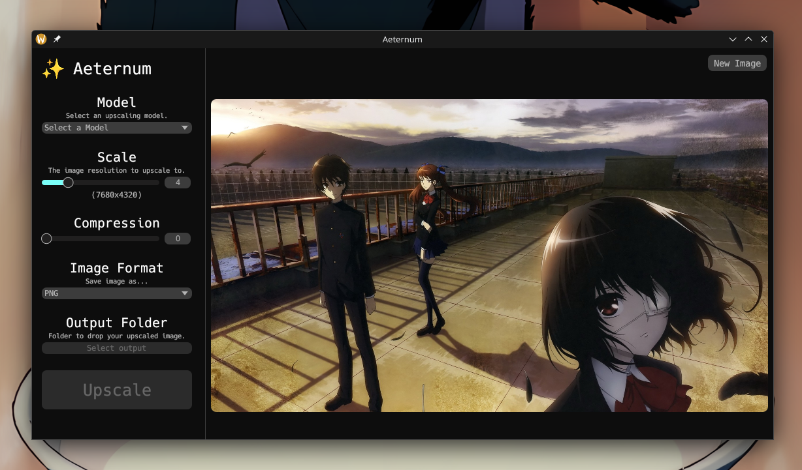
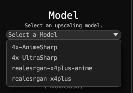
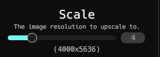
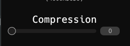
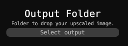
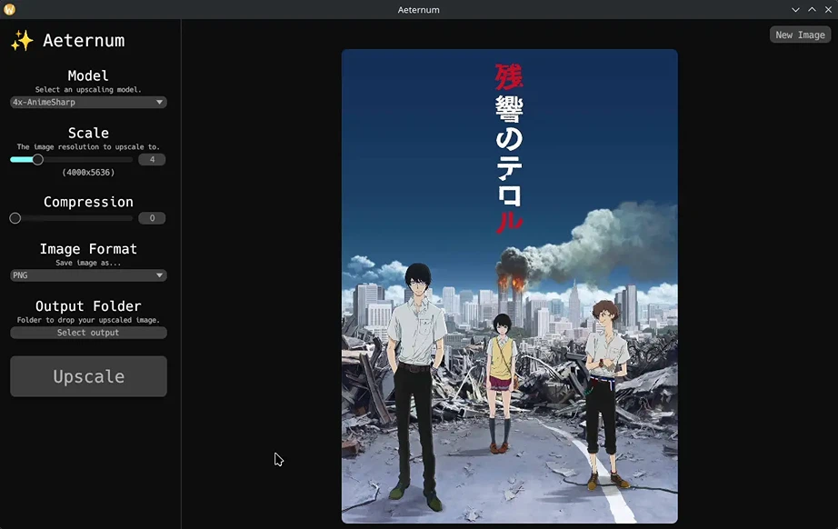

# 🔮 Aeternum


> Aeternum is a **free** and **open-source**, image upscaler powered by [ncnn](https://github.com/Tencent/ncnn) via [upscayl-ncnn](https://github.com/upscayl/upscayl-ncnn).

Being a cloudy-org application, it naturally follows the [Cloudy Philosophy](https://github.com/cloudy-org/.github/blob/main/philosophy.md).

It's designed to be **lightweight**, **privacy-respecting** and **simple**.

## Background
Aeternum was actually started by [me](https://ananas.moe) because i wanted to broaden the [cloudy-org](https://github.com/cloudy-org) catalogue and also a way of learning [rust](https://rust-lang.org/) aswell as [egui](https://github.com/emilk/egui).

## How to use?
!!! info
    At the moment, MacOS support is unknown, [me](https://ananas.moe) aswell as [goldy](https://devgoldy.xyz) don't own anything that runs MacOS. If you own a device with MacOS, please try running it and let us know via an [issue](https://github.com/cloudy-org/aeternum/issues/new) how it went.

Here's a quick guide how to start working with aeternum.

### Installing it
We currently support Windows 10 (and up) aswell as Linux!

!!! warn
    Like mentioned above MacOS support is unknown, we only provide a portable MacOS variant.

#### 🪟 Windows 10+
There's **multiple** ways of installing aeternum on your Windows device.

The easist is with the aeterum [installer](#win-installer).

##### Installer { #win-installer }
Start of by downloading the latest [aeternum-setup.exe](https://github.com/cloudy-org/aeternum/releases/download/latest/aeternum-setup.exe).

The install setup works like every other installer.

- **Select the install method.**
You can either install it for all users or only for yourself.

- **Select the Language.**

- **Accept the License.**
!!! warn
    By accepting this license, you accept that we are not liability for anything you do with it and that we also don't give you warranty for anything.

- **Select where it should be installed.**
!!! info
    By default it'll install into `C:\Program Files\aeternum`

- **Wait.**
The installer will now extract all important files for aeternum to work, in the directory what you specified in [step 4](#win-installer.4).

- **Done.**
Aeternum has finished installing and now can be used.

##### Portable
Start of by downloading the latest [aeternum-x86_64-pc-windows-msvc.zip](https://github.com/cloudy-org/aeternum/releases/download/latest/aeternum-x86_64-pc-windows-msvc.zip).

- **Extract the contents.**
This can be done with the normal windows explorer (or any other third party zip program like [7-zip](https://7-zip.org/)).

- **Open the folder.**
Open the folder with the extracted contents.

- **Run.**
Now you can open aeternum via the `aeternum.exe`.

!!! info
    This is how you'll have to open it up everytime, if you would like it via the Windows Search or via a shortcut on your desktop then we recommend you use the [installer](#win-installer) method.

#### 🐧 Linux
We recommend you using your package manager to install aeternum (if avaliable).

##### Package manager
The only official packages we provide are for Arch so the AUR, every other packages are provided by **third-parties**.

###### Bin
[](https://repology.org/project/aeternum-bin/versions)

For the **arch** package just use (we will use [yay](https://github.com/Jguer/yay) as an example here, replace yay if you use a different aur package manager):
```sh title="Terminal"
yay -Sy aeternum-bin
```

!!! info
    For every other linux distribution, you'll have to check if your package manager has the `aeternum-bin` package.

###### Build
This will build the package from the [latest release](https://github.com/cloudy-org/aeternum/releases/latest).

[](https://repology.org/project/aeternum/versions)

For the **arch** package just use (we will use [yay](https://github.com/Jguer/yay) as an example here, replace yay if you use a different aur package manager):
```sh title="Terminal"
yay -Sy aeternum
```

!!! info
    For every other linux distribution, you'll have to check if your package manager has the `aeternum` package.

##### Portable
Start of by downloading the latest [aeternum-x86_64-unknown-linux-gnu.tar.gz](https://github.com/cloudy-org/aeternum/releases/download/v0.1.2-beta.1/aeternum-x86_64-unknown-linux-gnu.tar.gz).

- **Extract the contents.**
You can either use your file manager or your terminal with the command:
```sh title="Terminal"
tar -xf aeternum-x86_64-unknown-linux-gnu.tar.gz
```

- **Open the folder.**
You can either `cd` into it or open it with your file manager.

- **Run.**
Now you can double click on `aeternum` or run it via your terminal with:
```sh title="Terminal"
./aeternum
```

### Using it

#### Select an image
Click on `Open Image` or drag and drop an image.

!!! failure
    Drag and dropping files currently doesn't work on Linux **with Wayland** yet.


#### Select a model
After selecting an image, you need to select a model to upscale with.
!!! info
    Aeternum comes with models by default.



#### Change scale
Change the scale if needed.



#### Change compression
Change the compression if needed.



#### Change export folder
Change the export folder if needed.
!!! info
    if you don't specify one, it'll be put in the same directory where the image you imported is.



#### Upscale
Press the `Upscale` button.


