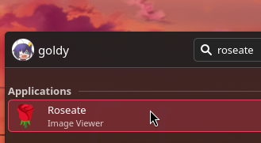
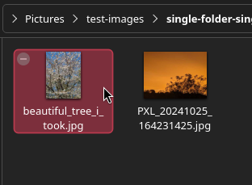

# How to use?

--8<-- "wip-page.md"

!!! info
    At the moment this wiki assumes you're on Linux, support for other platforms (Windows & MacOS) is work in progress and half-baked. If you're on these platforms and you're happy to help, we'll be very grateful if you can compile the image viewer and [report your issues to us](https://github.com/cloudy-org/roseate/issues). Additionally edits to [this wiki](https://github.com/cloudy-org/wiki/edit/main/docs/apps/roseate/index.md) would be great.

Welcome to this quick guide on how to use the Roseate image viewer. **It's simple!**

## Launching the image viewer.
Roseate can be launched in **3** primary ways, [if setup correctly](./setup.md):

1) Your terminal, by executing the binary.

=== "Linux"

    ```sh title="terminal"
    roseate
    ```

    2) Through your application launcher (or start menu).

=== "Windows"

    ```cmd title="terminal"
    start roseate
    ```

    2) Through your start menu by pressing :fontawesome-brands-windows: key.



3) Or by normally opening an image.



## Opening an image.
You can open an image in **3** primary ways:

1) Clicking on the **Open Image** button or the 🌹 **rose**, then selecting an image.


{: style="width:400px"}

2) Opening an image in your file explorer (as hinted previously).

3) By dragging and dropping into the viewer.

!!! failure
    Drag and dropping files currently doesn't work on Linux **with Wayland** yet.


4) Or via your terminal once again.

=== "Linux"

    ```sh title="terminal"
    roseate ./flowers.png
    ```

=== "Windows"

    ```sh title="terminal"
    start roseate ./flowers.png
    ```