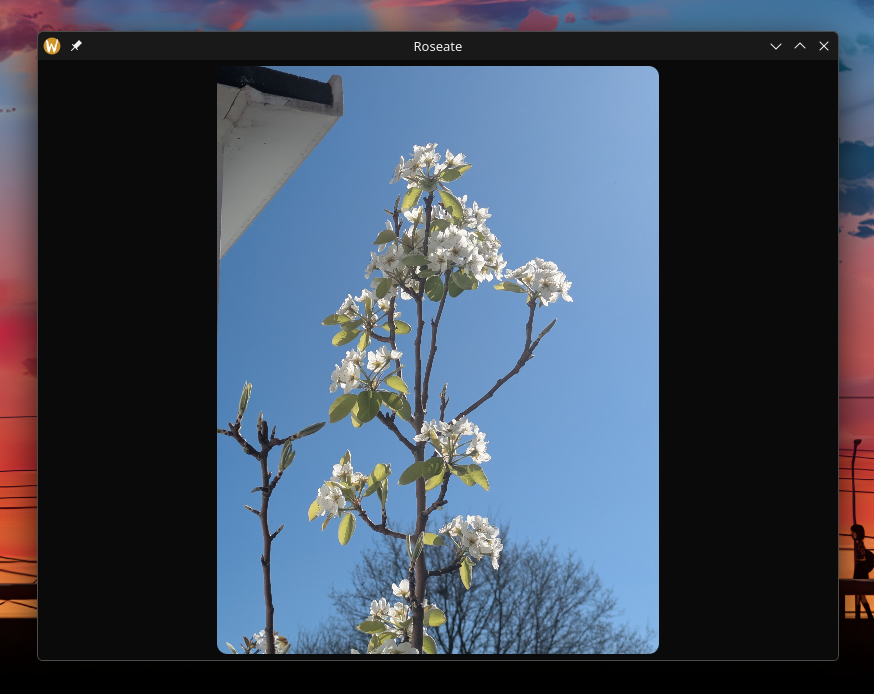
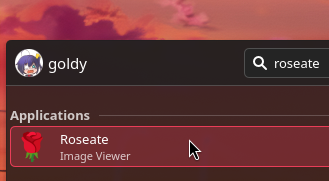
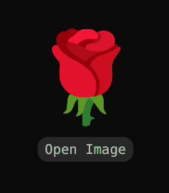

# 🌹 Roseate


!!! warning
    If you're looking for an [installation guide](./installation.md), there isn't one at the moment because Roseate is still <ins>**work in progress**</ins> and has not released yet.

> Roseate is a **free** and **open-source**, GPU accelerated, cross-platform and simplistic image viewer that's highly configurable and fast.

Being a cloudy-org application, it naturally follows the [Cloudy Philosophy](https://github.com/cloudy-org/.github/blob/main/philosophy.md).

It's designed to be **lightweight**, **privacy-respecting** and **stupidly fast** to launch and display images.


## Background
Roseate has been a passion project for [me](https://devgoldy.xyz) to learn the 🦀 Rust programming language, while also laying the groundwork for shared infrastructure across cloudy-org (like the [cirrus](https://github.com/cloudy-org/cirrus) tool-kit). Roseate actually begun as a [tauri](https://tauri.app/) web app but I wasn't happy with the memory usage and performance. Hence I switched to [Egui](https://github.com/emilk/egui) which currently runs natively via OpenGL, and ever since it's been pretty performant. Along the way, the switch has also been a great learning experience.

## How to use?
!!! info
    At the moment this wiki assumes you're on Linux, support for other platforms (Windows & MacOS) is work in progress and half-baked. If you're on these platforms and you're happy to help, we'll be very grateful if you can compile the image viewer and [report your issues to us](https://github.com/cloudy-org/roseate/issues). Additionally edits to [this wiki](https://github.com/cloudy-org/wiki/edit/main/docs/apps/roseate/index.md) would be great.

Welcome to this quick guide on how to use the Roseate image viewer. **It's simple!**

### Launching the image viewer
Roseate can be launched in **3** primary ways, [if setup correctly](./setup.md):

1) Your terminal, by executing the binary.

```sh title="terminal"
roseate
```

2) Through your application launcher (or start menu).



3) Or by normally opening an image.


### Opening an image
You can open an image in **2** primary ways:

1) Clicking on the **Open Image** button or the 🌹 **rose**, then selecting an image.


{: style="height:350px"}

2) Opening an image in your file explorer (as hinted previously).

3) Or by dragging and dropping into the viewer.

!!! failure
    Drag and dropping files currently doesn't work on Linux **with Wayland** yet.


<br>
***THIS WIKI IS STILL WIP...***