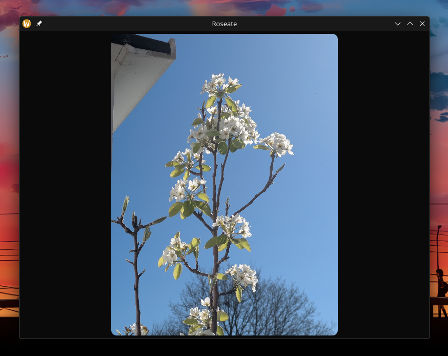

# 🌹 Roseate

!!! warning
    If you're looking for an [Installation Guide](./installation.md), there isn't one at the moment because Roseate is still <ins>**work in progress**</ins> and has not released yet.

> Roseate is a **free** and **open-source**, GPU accelerated, cross-platform and simplistic image viewer that's highly configurable and fast.

Being a cloudy-org application, it naturally follows the [Cloudy Philosophy](https://github.com/cloudy-org/.github/blob/main/philosophy.md).

It's designed to be **lightweight**, **privacy-respecting** and **stupidly fast** to launch and display images.

## Source Code
Under the **GNU GPL-3.0** license: **[https://github.com/cloudy-org/roseate](https://github.com/cloudy-org/roseate)**

## Background
> Roseate has been a passion project for [me][goldy_site] to learn the 🦀 Rust programming language, while also laying the groundwork for shared infrastructure across cloudy-org (like the [cirrus](https://github.com/cloudy-org/cirrus) tool-kit). Roseate actually begun as a [tauri](https://tauri.app/) web app but I wasn't happy with the memory usage and performance. Hence I switched to [Egui](https://github.com/emilk/egui) which currently runs natively via OpenGL, and ever since it's been pretty performant. Along the way, the switch has also been a great learning experience.
> 
> **~ [Goldy][goldy_site]**

## Index

- [How to use?](./how_to_use.md) - Quick guide on how to use Roseate.
- [Installation](./installation.md) - A straightforward and beginner friendly installation guide.
- [Advanced Installations](./advanced_installs.md) - An in-depth installation guide for **advanced users**.

[goldy_site]: https://devgoldy.xyz