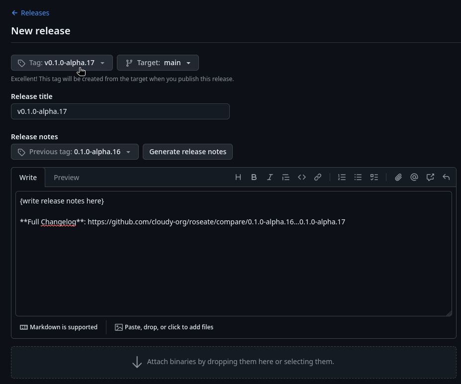

# Releases
Hi, this is the cloudy-org convention for releasing applications.

Currently this convention is still being written so not everything will be covered, but below is what we do cover so far.

## Releasing binaries
The main way of releasing application binaries currently is via github releases.

{ width="550" }

1. Create a github release linked to appropriate tag.
2. Write up release notes (mention relevant PRs & issues, changes occurred since last [tag](https://git-scm.com/book/en/v2/Git-Basics-Tagging)).
3. Attach your binaries.

### Tag naming covention
> It’s common practice to prefix your version names with the letter **v**. Some good tag names might be v1.0.0 or v2.3.4. **~ GitHub**

Tags that tag application verions like `0.1.0-alpha.16` **must** be prefixed with lowercase `v` like so:
```
v0.1.0-alpha.16
```

### The convention of uploading binaries.
At cloudy-org we plan to offer 3 different types of binaries on application release **at the moment**. Generally "standalone binary" is all that's necessary and is also the recommended binary type at cloudy-org.

- **Standalone binary** (common with **Linux** and package manager releases)
- **Setup executable** / installer (common on **Windows**, also known as "packaged" installation, may include an updater) [^1]
- **Portable binary** (a **standalone binary** but it's designed to be portable and run the application in a portable fashion) [^2]

The last one is less common but some applications may support it so we can do cool things like installing the entire application, **with configuration files included**, onto a USB stick to run live on other machines (e.g. computers at the library or a system with no internet connection).

This is how we expect binaries to look like in a github release:
```sh
roseate-linux-x86_64
roseate-macos-x86_64
roseate-win-x86_64.exe
roseate-win-x86_64-setup.exe
```
> [`roseate`](../apps/roseate/index.md) here being the name of the application.

For **Linux** we release a binary (`example-linux-x86_64`) that is pulled by package managers. Package managers will also handle installation of all required dependencies, we just provide the plain standalone binary. Updates are also handled via distro package managers.

For **MacOS** we will do the same just like Linux, providing just the standalone executable binary (`example-macos-x86_64`). Third-party package managers like Homebrew will handle everything else. **However** do note that we are new to this platform, hence this will most likely change.

With **Windows** we'll provide users with an installer executable (`setup.exe` / `example-win-x86_64-setup.exe`) as par what the Windows industry has historically settled with, but we'll also provide you with a package manager (standalone binary, `example-win-x86_64.exe`) alternative via a platform like [Scoop](https://scoop.sh/) (this will be what we recommend). The installer will come packaged with most components or dependencies required, the package manager alternative will automatically install these dependencies and handle updates **elegantly**.

<!-- TODO: Expand on these conventions below in `/conventions`, this needs it's own place. -->

[^1]: Should be compiled with a `packaged` Rust [Cargo feature](https://doc.rust-lang.org/cargo/reference/features.html) on **Windows** to enable components like an app updater.
[^2]: Should be compiled with a `portable` Rust [Cargo feature](https://doc.rust-lang.org/cargo/reference/features.html) to signal to other parts of the program that we are dealing with a portable version of the application (e.g: `cirrus-config` should store config files at the location of the portable binary instead of OS config directory).