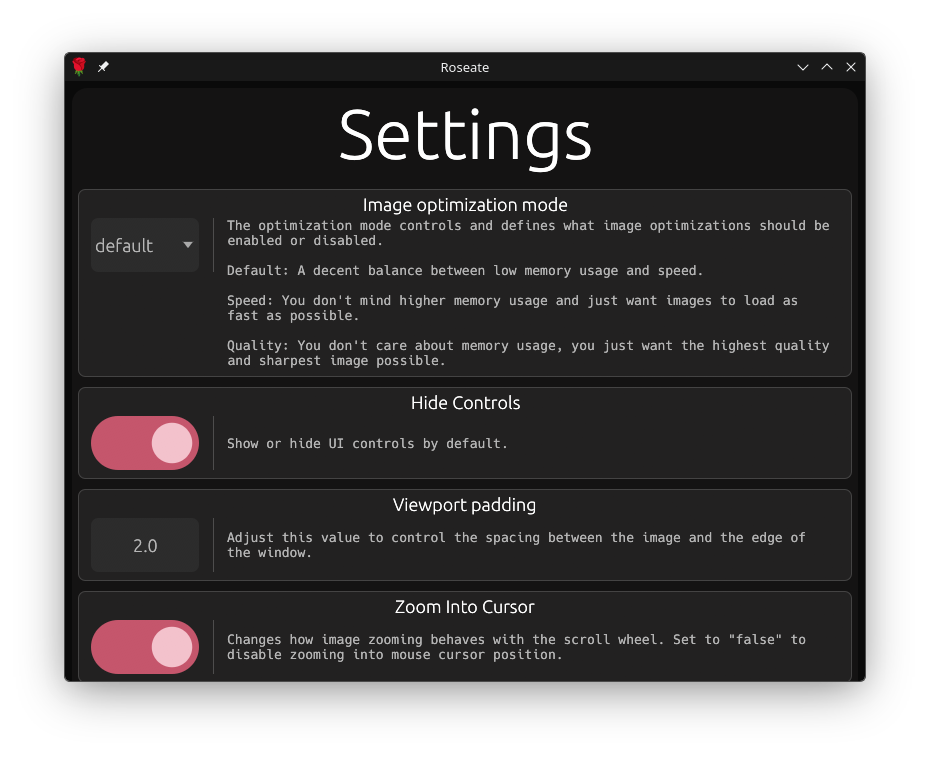

# Settings Menu

Most cloudy-org **egui** applications using the **[cirrus](https://github.com/cloudy-org/cirrus)** toolkit have a settings menu you can access with the `CTRL + ,` key bind.

> Settings menu from **[Roseate](../apps/roseate/index.md)**.

## Exiting
To exit the menu press `ESC` or `CTRL + ,` (again).

## Saving
You can press `CTRL + S` to **force save** your settings, otherwise they will be saved upon exit one way or another.

## Supported Applications
- [Roseate](../apps/roseate/index.md)